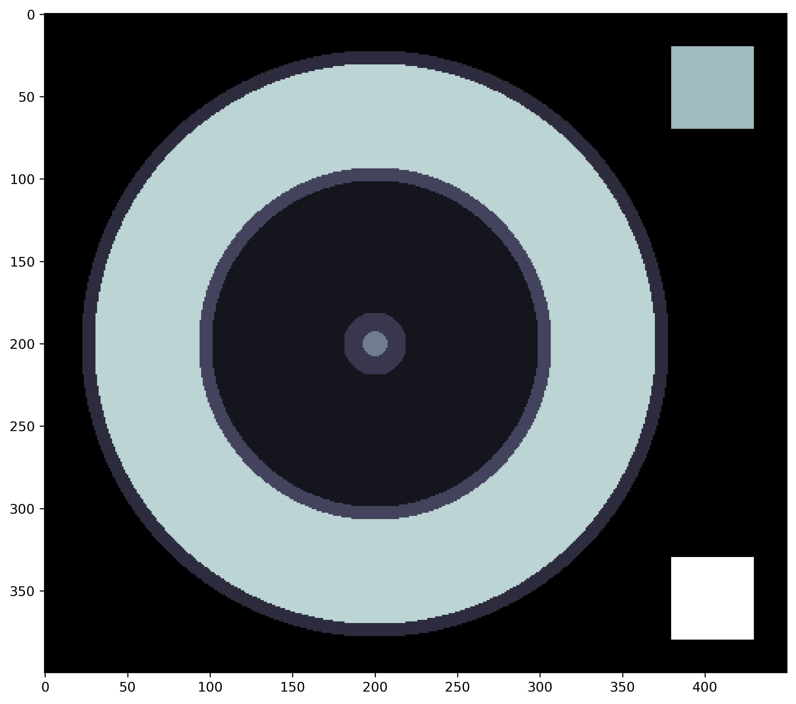
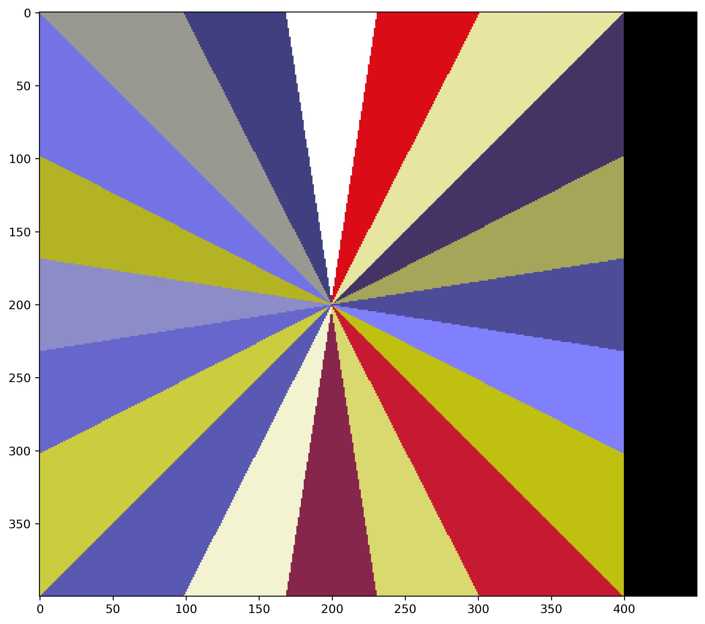
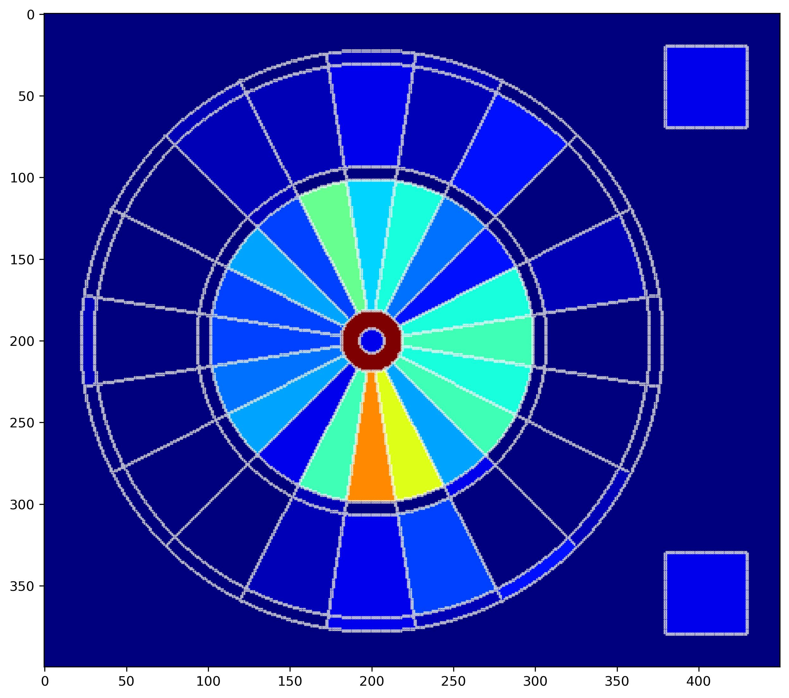

# Description
This Jupyter notebook was is a basic dart tracker that can be used to visualize improvements in dart throwing ability over time without the need for sophistocated tracking software. In short, this notebook will allow you to visualize what sections of the dartboard you are hitting over time with very minimal coding skill needed. This notebook will provide both a background as to how the code works, the general logic behind the setup, and then ultimately how to track dart throwing to generate a heatmap video.
# Examples
This notebook, as stated before, will first go through the general logic behind how the code works and how the dart board in python was created. For those who are not interested in the technical coding aspects, all functions care called to the notebook but not written out in the notebook, making it more user friendly.

**Figure 1**: *Left: Array displaying the different positions, such as 2X, 3X, etc. Right: Array displaying the different number values on a dartboard*

The notebook will then allow you to upload your own data and generate an array for every consecutive dart thow. These images can be exported and compiled into a movie using other programs.

**Figure 2**: *Example heatmap. The more red the section, the more times that section has been hit. This is 1D array (think x and y coordinates) displayed from a 3D array where the third dimenion is each throw.*

# Getting Started
## Dependencies
- Python 3.1 (other versions not guaranteed)
  
## Installing
- git clone https://github.com/msindoni/darts_tracker.git
- conda env create -f environment.yml
- conda env create -f requirements.txt

# Executing PRogram

